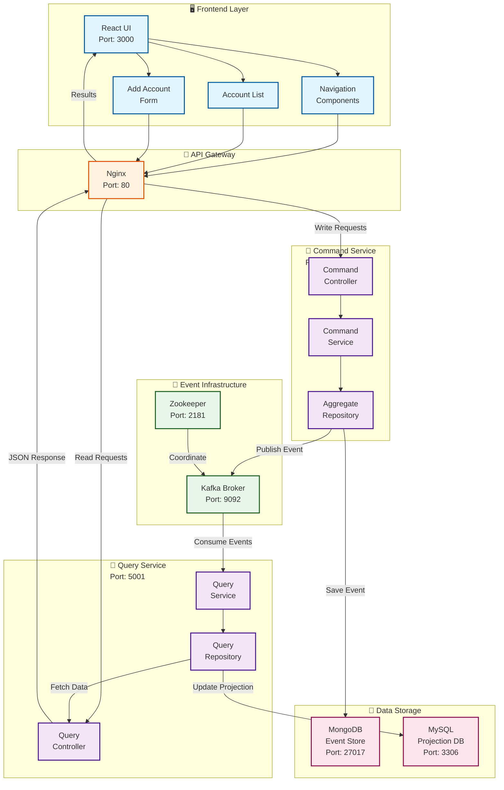
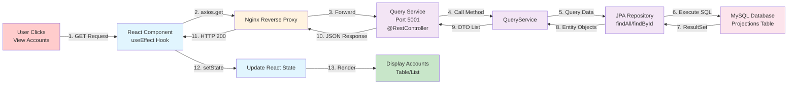
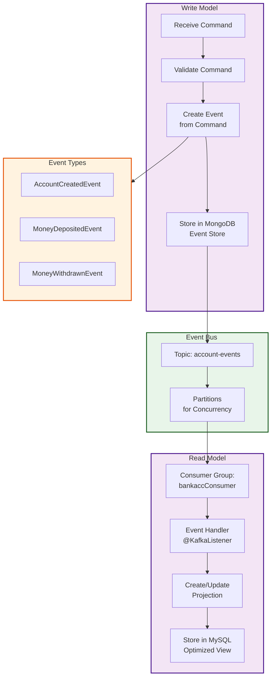
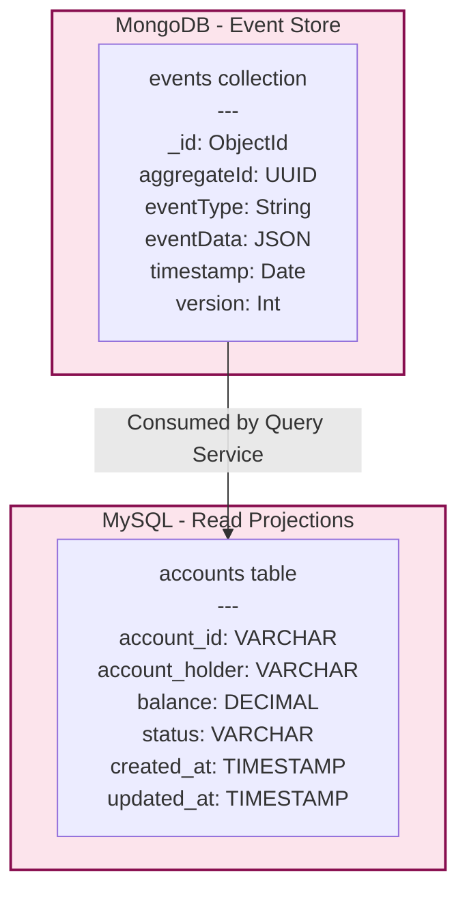
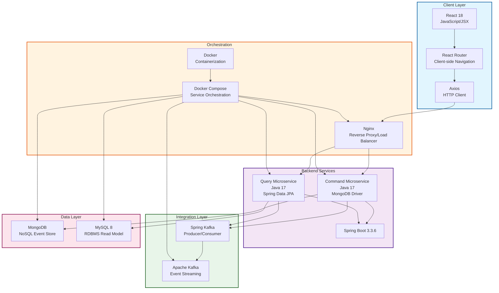

# Bank Account CQRS System - Mermaid Flow Diagram

## System Architecture Overview



---

## Detailed Write Flow (Create/Deposit/Withdraw)

```mermaid
graph LR
    A["User Action<br/>Create/Deposit/Withdraw"] -->|1. HTTP POST| B["React UI<br/>AccountList/AddAccount"]
    B -->|2. axios.post| C["Nginx Reverse Proxy<br/>Port 80"]
    C -->|3. Forward| D["Command Service<br/>Port 5002<br/>@RestController"]
    D -->|4. Create Command| E["CommandHandler"]
    E -->|5. Apply Event| F["Aggregate<br/>AccountAggregate"]
    F -->|6. Persist| G["MongoDB Event Store<br/>Event Document"]
    F -->|7. Publish Event| H["Spring Kafka<br/>Topic: account-events"]
    H -->|8. Async Process| I["Query Service<br/>Event Consumer"]
    I -->|9. Create Projection| J["JPA Repository"]
    J -->|10. Insert/Update| K["MySQL Read Model<br/>Projections Table"]
    K -->|11. Done| L["User Sees Update<br/>via Next Query"]

    style A fill:#ffcccc
    style B fill:#e1f5fe
    style C fill:#fff3e0
    style D fill:#f3e5f5
    style E fill:#f3e5f5
    style F fill:#f3e5f5
    style G fill:#fce4ec
    style H fill:#e8f5e9
    style I fill:#f3e5f5
    style J fill:#f3e5f5
    style K fill:#fce4ec
    style L fill:#c8e6c9
```



---

## Detailed Read Flow (Fetch Accounts)



---

## Event-Driven Architecture Flow



---

## Database Schema Overview



---

## Technology Stack Mapping



---

## Request/Response Cycle Summary

| Phase | Component | Technology | Action |
|-------|-----------|-----------|--------|
| **1. User Interface** | React UI | JavaScript/React | User interacts with UI |
| **2. Client Request** | Browser | Axios HTTP Client | Makes API call |
| **3. Routing** | Nginx | Reverse Proxy | Routes to appropriate service |
| **4. Command Processing** | account.cmd | Spring Boot | Validates and processes command |
| **5. Event Storage** | MongoDB | Document Database | Persists event to event store |
| **6. Event Publishing** | Kafka Producer | Message Broker | Publishes event to topic |
| **7. Event Consumption** | Kafka Consumer | Message Broker | Query service receives event |
| **8. Projection Update** | account.query | Spring Data JPA | Updates read model |
| **9. Data Persistence** | MySQL | RDBMS | Stores optimized projection |
| **10. Query Execution** | account.query | JPA Repository | Fetches data from projections |
| **11. Response** | API Response | JSON | Returns data to frontend |
| **12. UI Update** | React State | setState/Hooks | Updates and renders UI |

---

## Port Reference Guide

```
┌─────────────────────────────────────────┐
│         SERVICE PORTS MAPPING           │
├─────────────────────────────────────────┤
│ React UI (Nginx)        │ 3000 / 80     │
│ Command Service         │ 5002          │
│ Query Service           │ 5001          │
│ MySQL Database          │ 3306          │
│ MongoDB                 │ 27017         │
│ Kafka Broker            │ 9092          │
│ Zookeeper               │ 2181          │
└─────────────────────────────────────────┘
```

---

## Key Features & CQRS Principles

### ✅ Command Side (Write Model)
- Receives commands from UI
- Creates and stores events in MongoDB
- Publishes events to Kafka
- Ensures business rule validation
- Uses MongoDB for event sourcing

### ✅ Query Side (Read Model)
- Listens to events from Kafka
- Updates optimized projections in MySQL
- Handles all read requests
- Fast query performance
- Eventually consistent with write side

### ✅ Event-Driven Communication
- Asynchronous update propagation
- Eventual consistency
- Decoupled services
- Scalable architecture
- Event audit trail

### ✅ Technology Benefits
- **Separation of Concerns**: Commands ≠ Queries
- **Scalability**: Independent scaling of read/write
- **Performance**: Optimized read models in MySQL
- **Auditability**: Complete event history
- **Resilience**: Decoupled services via events
